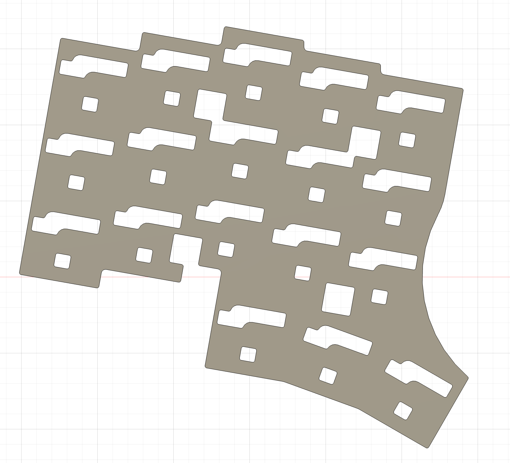

# cocochim36 ビルドガイド

販売するタイミングで微妙に同梱されるフォームが異なる可能性があるので, バージョンを分けてビルドガイドを書いています

## 販売されていた場所

- キーケット 2025
- [keyket2025 の extra 扱い (キーケットに持っていけなかったり 3DP バージョンとして出したもの)](https://keeb.arashike.com/en/products/keyket2025-extra-cocochim36)

## 手順

### ケースフォームの設置

- ケースフォームが3枚入っている場合は以下のフォームを利用ください
  - underglow 用の穴が入っているフォーム x 1枚
  - underglow 用の穴が入っていないフォーム x 1枚
- ケースフォームが2枚入っている場合は以下のフォームを利用ください
  - そのまま2枚敷いてください

underglow の穴が空いてるフォーム

underglow の穴が空いていないフォーム

### スイッチフォーム

PCB とスイッチプレートの間にスイッチフォームを敷きます

### ガスケットの貼り付け

ガスケットはケース側, スイッチプレート側, どっちに貼ってもよいのですが, スイッチプレート側に貼る方が貼りやすいかもです (自分はスイッチプレートに貼っています)

ガスケットを貼った後は数か所キースイッチで抑えることで, PCBとスイッチプレートを締結します

### 上下ケースを締結

付属のネジでスイッチフォーム, PCB, スイッチプレートをケース内に入れた状態で上下ケースを締結します

この時点で上から順に
1. トップボディ
2. スイッチプレート
3. スイッチフォーム
4. PCB
5. ケースフォーム
6. ボトムボディ
という順で構成されています

### ゴム足

ゴム足をつけます

### リングケース (兼トラボカバー)

リングケースはスクロールリングの凸凹に合うように削ってあるので,

そのままぱかっと上からはめ込みが可能です

リングケースはそのままスクロールリングのノブ的な使い方もできます.

### 完成!!

残りのキースイッチ, キーキャップを取り付けて完成です!
